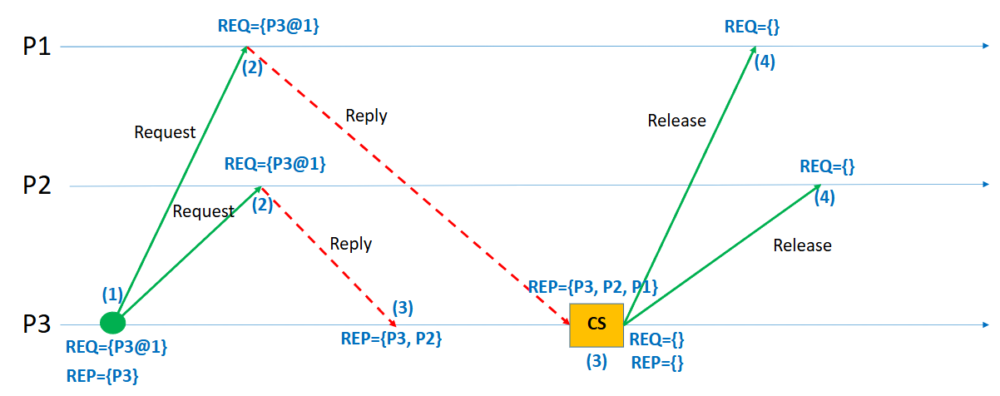
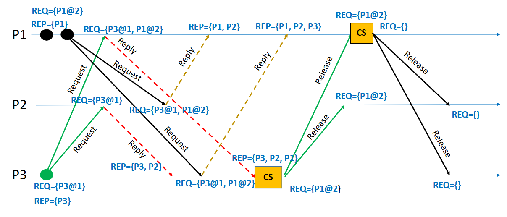

## 1. Introduction

In distributed systems, processes often need exclusive access to shared resources, such as files, databases, or hardware. Ensuring that **no two processes access a critical section (CS) simultaneously** is crucial to maintain **data consistency** and **system correctness**. Unlike centralized systems, **distributed systems** lack a global clock and shared memory, making coordination significantly harder.

**Mutual exclusion** in such environments must be achieved **only through message passing**.
One of the pioneering solutions to this problem is **Lamport’s Algorithm**, introduced by **Leslie Lamport** in 1978. It uses the concept of **logical clocks** to establish a partial ordering of events, enabling processes to decide who gets access to the critical section in a fair and consistent manner.

---

## 2. Problem Statement

The challenge in distributed systems is to enforce mutual exclusion while handling:
- **No global clock:** No single source of time synchronization.
- **Message delays:** Communication between processes may have arbitrary, unpredictable delays.
- **Asynchronous events:** Processes can operate independently and concurrently.
- **No shared memory:** Only communication is via network messages.

Thus, the mutual exclusion protocol must ensure:
- **Safety:** At most one process is in the critical section at any time.
- **Liveness:** Every request eventually gets served (no starvation).
- **Ordering:** Requests are honored based on time/order of arrival.

---

## 3. Lamport’s Logical Clocks: Foundation

Before understanding the mutual exclusion algorithm, we must understand **Lamport’s Logical Clocks**.

- Each process maintains a local clock (an integer counter).
- Clocks advance according to two simple rules:
  1. **Increment:** Before executing an event (internal, send, or receive), increment the local clock.
  2. **Message Transmission:** When sending a message, include the current clock value.
  3. **Message Reception:** Upon receiving a message, update the local clock as
     > localClock = max(localClock, receivedTimestamp) + 1

This way, **the "happened-before" relationship (`→`)** among events can be partially ordered even without synchronized physical clocks.

---

## 4. Lamport’s Mutual Exclusion Algorithm

### **Steps for a Process `P` to Enter and Exit the Critical Section:**

1. **Request Phase:**
   - Increment the local clock.
   - Broadcast a `REQUEST` message (containing timestamp and process ID) to all other processes, including itself.
   - Add its own request to its **local request queue**.

2. **Reply Phase:**
   - When a process `Q` receives a `REQUEST` message:
     - Add the request to its local queue.
     - Send back a `REPLY` message immediately.

3. **Entering Critical Section:**
   - Process `P` can enter its critical section when:
     - Its own request is at the **head** of its local queue **AND**
     - It has received a `REPLY` from every other process.

4. **Release Phase:**
   - After leaving the critical section, process `P`:
     - Removes its request from its local queue.
     - Broadcasts a `RELEASE` message to all other processes.

5. **Handling RELEASE:**
   - Upon receiving a `RELEASE` message, a process removes the corresponding request from its queue.

---

## 5. Example Scenario

In this example, three processes — P1, P2, and P3 — are participating in Lamport’s mutual exclusion protocol. The goal is for process P3 to enter the critical section (CS) while maintaining the principles of mutual exclusion in a distributed system.

The sequence begins with P3 deciding to request access to the critical section. Before sending out its request, P3 increments its logical clock to 1, ensuring that the event is timestamped correctly. It then broadcasts a `REQUEST` message, containing its identifier and timestamp (`P3@1`), to all other processes, namely P1 and P2, as well as to itself. Upon sending the request, P3 adds its own request to its local request queue. Additionally, it logically considers that it has already replied to itself (this is why P3 appears immediately in its reply set).

Once P1 and P2 receive the `REQUEST` message from P3, they each handle it by following Lamport’s rules. Upon receipt, they update their logical clocks if necessary (ensuring they are greater than or equal to the received timestamp) and add P3’s request (`P3@1`) to their local request queues. Because neither P1 nor P2 is currently interested in entering the critical section, they immediately send a `REPLY` message back to P3, acknowledging its request.

P3 waits to collect `REPLY` messages from all participating processes (including itself, which is implicit). After it receives `REPLY` messages from both P1 and P2, and since its own request is at the head of its local request queue, P3 meets the two conditions required to safely enter the critical section: (1) it holds the earliest request (lowest timestamp) and (2) it has received permission from all other processes. At this point, P3 enters the critical section, as shown in the diagram by the yellow "CS" box.

After P3 finishes its operation inside the critical section, it must release the resource to allow other processes to make progress. To do this, P3 increments its logical clock and broadcasts a `RELEASE` message to P1 and P2. Upon receiving the `RELEASE` message, both P1 and P2 remove P3’s request from their local queues, recognizing that P3 no longer holds the critical section. Once the release is completed, all processes’ request queues are empty, and they are ready to handle new requests from any process in the future.

This sequence of events ensures that mutual exclusion is properly enforced. At no point do two processes enter the critical section simultaneously, and P3 is able to make progress after fairly receiving replies from its peers. Additionally, the ordering based on logical timestamps guarantees that requests are honored in the order they were made, preserving the causality and fairness expected in distributed systems.

In terms of communication overhead, this simple operation required six messages in total: two requests sent to P1 and P2, two replies received from P1 and P2, and two releases sent back to P1 and P2. Although relatively lightweight for a small system, it highlights that Lamport’s algorithm scales linearly with the number of participating processes. Nevertheless, the algorithm provides a clean, elegant way to coordinate access to shared resources across independent processes, entirely based on message exchanges and logical clocks, without any need for global time synchronization or centralized control.

A more complex example is given below, where multiple processes are requesting access to the critical section. See if you can follow the sequence of events and understand how Lamport’s algorithm ensures mutual exclusion.

---

## 6. How Mutual Exclusion is Achieved

- **Ordering via Timestamps:**
  Requests are ordered based on their logical timestamps (smaller timestamp = higher priority).

- **Total Ordering with Tie-breaking:**
  If two requests have the same timestamp, the process with the **smaller process ID** gets priority.

- **Guaranteeing Safety:**
  Because a process waits for replies from all other processes and ensures its request is first in the queue, **no two processes can be in the critical section at the same time**.

- **Guaranteeing Liveness:**
  Because every request is eventually responded to and ordered correctly, **every process eventually enters** the critical section, ensuring **no starvation**.

---

## 7. Practical Aspects & Challenges

| Aspect | Practical Insight |
|:---|:---|
| **Communication Overhead** | Every critical section entry requires 2(N-1) messages (N is number of processes): N-1 requests + N-1 replies. |
| **Scalability** | The algorithm becomes costly with large numbers of processes due to O(N) messaging per CS entry. |
| **Fault Tolerance** | Basic Lamport’s algorithm does not handle process crashes. Advanced versions extend it. |
| **Message Delays** | The algorithm tolerates arbitrary message delays but assumes reliable delivery (no message loss). |
| **Clock Synchronization** | Logical clocks are only about **event ordering**, not actual real-world time. |
| **Priority Aging** | Since requests are ordered, newer requests cannot jump ahead — preserving fairness but possibly delaying them longer. |

---

## 8. Comparison with Other Distributed Mutual Exclusion Algorithms

- **Ricart-Agrawala Algorithm:**
  Improves upon Lamport by reducing messages to N-1 (only requests and replies, no releases).

- **Token Ring Algorithm:**
  Uses a circulating token to grant access, reducing message complexity but adding risk of token loss.

- **Maekawa’s Algorithm:**
  Reduces message count to about √N but introduces possible deadlocks needing resolution.

Lamport's approach, despite being heavier in message complexity, is **simple, general, and highly intuitive**, making it a popular teaching tool for distributed mutual exclusion concepts.

---

## 9. Real-World Applications

- **Distributed Databases:** Ensuring atomic transactions without double-writes.
- **Cloud Systems:** Managing exclusive locks across microservices.
- **Blockchain & Consensus Protocols:** Underlying idea of ordering events fairly without centralized clocks.
- **Distributed File Systems:** Guaranteeing exclusive file access across data centers.
